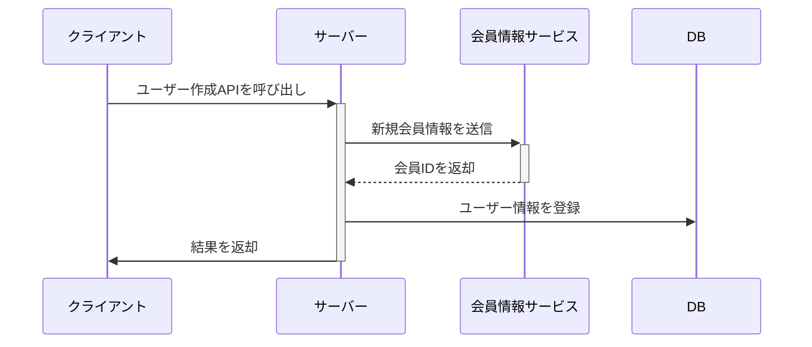

# API01 ユーザー作成

## 処理概要

本APIは、新しいユーザーを作成するAPIです。

## エンドポイント

```bash
POST /api/user
```

## リクエスト
- メソッド: `POST`
- Content-Type: `application/json`
- リクエストボディ
```json
{
  "user_name": "string",        
  "email": "string",           
  "password": "string",        
  "first_name": "string",       
  "last_name": "string"    
}
```

## 処理シーケンス


