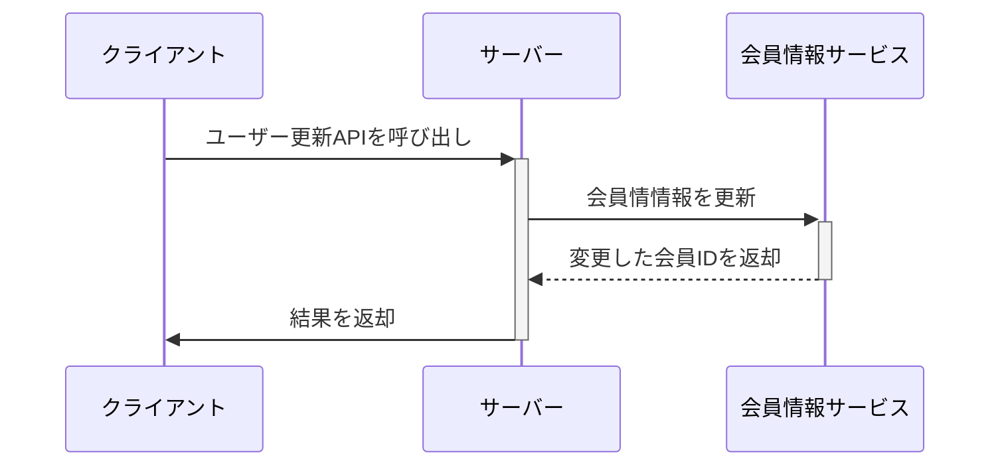

# API02 ユーザー更新

## 処理概要

本APIは、ユーザー情報を更新するAPIです。

## エンドポイント

```bash
POST /api/user/:id
```

## リクエスト
- メソッド: `PUT`
- Content-Type: `application/json`
- リクエストボディ
```json
{
  "user_id": "string",
  "user_name": "string",        
  "email": "string",           
  "password": "string",        
  "first_name": "string",       
  "last_name": "string"    
}
```

## 処理シーケンス

